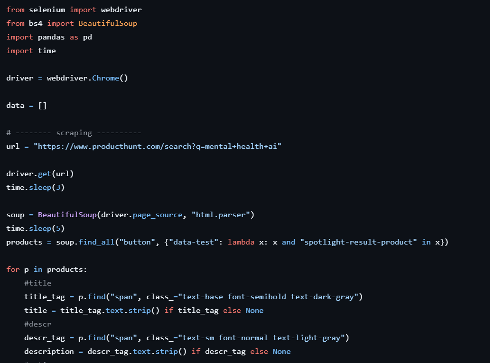
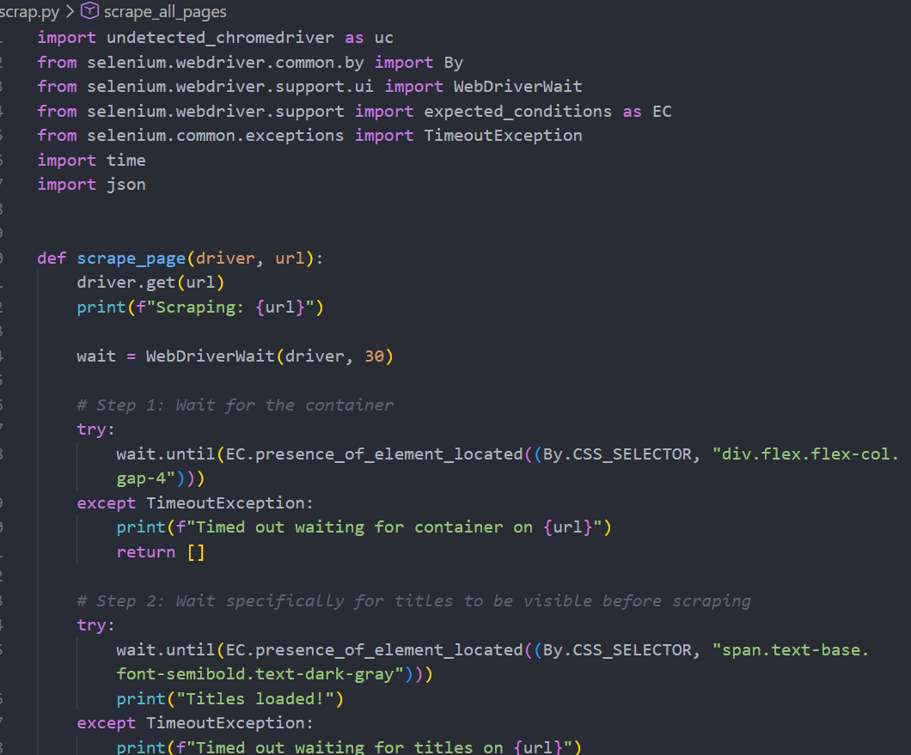

# ProductHunt Explorer

## Project Overview

ProductHunt Explorer is a Streamlit application that allows users to:

- Search ProductHunt products
- View results in a table
- Visualize product statistics
- Perform sentiment analysis using a Hugging Face model

## Scraping Update

During the development of this project, I encountered limitations with the initial ProductHunt scraping implementation. The original scraper was only able to collect a small amount of data, which was not sufficient for the analysis and visualization tasks.

I attempted to extend the scraper to collect data from multiple pages, but the approach did not work reliably due to changes in the website structure and navigation behavior.

To overcome this issue, I developed a new scraping solution and re-scraped the ProductHunt website. The new implementation collects a larger and more complete dataset, which is used throughout this project for visualization and sentiment analysis.


<table>
<tr>
<td align="center">
<b>Previous Scraper</b><br>
<br>
Collected only a small number of products and could not reliably navigate multiple pages.
</td>

<td align="center">
<b>New Scraper</b><br>
<br>
Improved implementation capable of collecting a larger and more complete dataset.
</td>
</tr>
</table>

## Technologies Used

- Python
- Streamlit
- Selenium
- BeautifulSoup
- Pandas
- Matplotlib
- Hugging Face Transformers

## Running the Project
## Running the Application

```bash
cd streamlit_app
streamlit run home.py
```